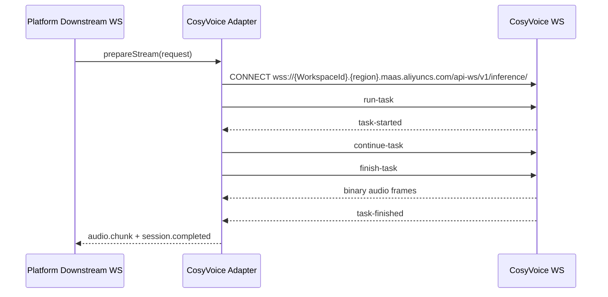

# CosyVoice Adapter Contract

## 文档来源

- 声音复刻: https://www.alibabacloud.com/help/zh/model-studio/voice-cloning-user-guide
- 非实时语音合成: https://help.aliyun.com/zh/model-studio/non-realtime-tts-user-guide
- 实时语音合成: https://help.aliyun.com/zh/model-studio/realtime-tts-user-guide
- 模型说明: https://help.aliyun.com/zh/model-studio/tts-model
- 本仓库接入笔记: `docs/vendor_api_doc/cosyvoice/ACCESS_METHODS.md`

## Provider Definition

```json
{
  "providerId": "cosyvoice",
  "providerName": "CosyVoice",
  "adapterVersion": "0.1.0",
  "vendorFeatures": {
    "supportsHttpTTS": true,
    "supportsStreamingTTS": true,
    "supportsPersistentVoiceClone": true,
    "supportsInstantVoiceClone": false,
    "supportsVoiceCloneDelete": false
  }
}
```

## Models

```json
{
  "defaultModel": "cosyvoice-v3.5-plus",
  "models": [
    "cosyvoice-v3.5-plus",
    "cosyvoice-v3.5-flash",
    "cosyvoice-v3-plus",
    "cosyvoice-v3-flash",
    "cosyvoice-v2",
    "cosyvoice-v1"
  ],
  "outputFormats": ["mp3", "wav"],
  "sampleRatesHz": [16000, 24000, 48000]
}
```

`cosyvoice-v3.5-plus` 和 `cosyvoice-v3.5-flash` 不提供系统音色。合成时必须传入复刻或声音设计得到的 `voice_id`。

## HTTP TTS Contract

### Facade Request

```json
{
  "operation": "tts.sync",
  "providerId": "cosyvoice",
  "text": "家长您好，我们这边可以先给孩子安排一节免费的试听课。",
  "model": "cosyvoice-v3.5-plus",
  "voice": {
    "providerVoiceId": "voice_id_from_create_voice"
  },
  "output": {
    "format": "mp3",
    "sampleRateHz": 24000
  },
  "controls": {
    "volume": 50,
    "speed": 1,
    "pitch": 1
  },
  "vendor": {
    "mode": "prefer_vendor",
    "extensions": {
      "cosyvoice": {
        "schemaVersion": "1.0.0",
        "params": {
          "instruction": "用自然、亲切的客服语气朗读。"
        }
      }
    }
  }
}
```

### Vendor HTTP Request

```json
{
  "method": "POST",
  "url": "https://${COSYVOICE_WORKSPACE_ID}.cn-beijing.maas.aliyuncs.com/api/v1/services/audio/tts/SpeechSynthesizer",
  "headers": {
    "Authorization": "Bearer ${COSYVOICE_API_KEY}",
    "Content-Type": "application/json"
  },
  "body": {
    "model": "cosyvoice-v3.5-plus",
    "input": {
      "text": "家长您好，我们这边可以先给孩子安排一节免费的试听课。",
      "voice": "voice_id_from_create_voice",
      "format": "mp3",
      "sample_rate": 24000,
      "volume": 50,
      "rate": 1,
      "pitch": 1,
      "instruction": "用自然、亲切的客服语气朗读。"
    }
  }
}
```

非实时响应应包含 24 小时有效的音频 URL。Adapter 会下载该 URL，并把音频写入统一 run archive。

### Archive Contract

```txt
data/runs/{runId}/
  request.json
  plan.json
  mapping-report.json
  vendor-request.json
  vendor-response.json
  result.json
  audio.mp3
```

## Voice Clone Contract

### Facade Request

```json
{
  "operation": "voice.clone.create",
  "providerId": "cosyvoice",
  "displayName": "customer_service_voice",
  "model": "cosyvoice-v3.5-plus",
  "referenceAudio": [
    {
      "uri": "https://example.com/source.wav",
      "format": "wav"
    }
  ],
  "consent": {
    "confirmed": true,
    "speakerName": "authorized speaker",
    "usageScope": "internal_eval"
  }
}
```

### Vendor HTTP Request

```json
{
  "method": "POST",
  "url": "https://${COSYVOICE_WORKSPACE_ID}.cn-beijing.maas.aliyuncs.com/api/v1/services/audio/tts/customization",
  "headers": {
    "Authorization": "Bearer ${COSYVOICE_API_KEY}",
    "Content-Type": "application/json"
  },
  "body": {
    "model": "voice-enrollment",
    "input": {
      "action": "create_voice",
      "target_model": "cosyvoice-v3.5-plus",
      "prefix": "customer_service_voice",
      "url": "https://example.com/source.wav"
    }
  }
}
```

返回中的 `voice_id` 会保存为平台 voice registry 记录。`voice_id` 与创建时的 `target_model` 绑定，不能跨模型复用。

## WebSocket TTS Contract

当前 adapter 已实现 CosyVoice 上游 WebSocket 的 `text_once` transport。默认优先使用 Workspace `/api-ws/v1/inference/`；没有 WorkspaceId 时使用 DashScope 全局 inference 入口 `wss://dashscope.aliyuncs.com/api-ws/v1/inference`，这条路径只需要 API Key，不需要 WorkspaceId。

`wss://dashscope.aliyuncs.com/api-ws/v1/realtime` 是另一套 DashScope realtime 协议入口，不能直接接收本文档中的 `run-task` / `SpeechSynthesizer` task 帧。若显式配置该入口，当前 adapter 会把路径规范化为同 host 的 `/api-ws/v1/inference` 并在 mapping report 中记录 warning。

当前限制：下游 `text.append` / `input.end` 增量输入协议已预留，但尚未桥接到 adapter 输入队列；当前 transport 使用 plan 中的 `canonicalRequest.text` 发送一次 `continue-task`，随后发送 `finish-task`。



### Endpoint Resolution

```txt
1. COSYVOICE_STREAM_ENDPOINT
2. cosyvoice_inference_endpoint
3. DASHSCOPE_INFERENCE_ENDPOINT / dashscope_inference_endpoint
4. wss://{WorkspaceId}.{region}.maas.aliyuncs.com/api-ws/v1/inference/
5. wss://dashscope.aliyuncs.com/api-ws/v1/inference
```

HTTP 非实时合成和声音复刻仍需要 `COSYVOICE_WORKSPACE_ID`。只有 WebSocket stream transport 可以在没有 WorkspaceId 时使用全局 endpoint。
如果 adapter 被显式传入 `/api-ws/v1/realtime` endpoint，当前会规范化到 `/api-ws/v1/inference`。

### Run Task Frame

```json
{
  "header": {
    "action": "run-task",
    "task_id": "plan20260703180000abcd1234",
    "streaming": "duplex"
  },
  "payload": {
    "task_group": "audio",
    "task": "tts",
    "function": "SpeechSynthesizer",
    "model": "cosyvoice-v3.5-plus",
    "parameters": {
      "text_type": "PlainText",
      "voice": "voice_id_from_create_voice",
      "format": "mp3",
      "sample_rate": 24000,
      "volume": 50,
      "rate": 1,
      "pitch": 1,
      "enable_ssml": false,
      "instruction": "用自然、亲切的客服语气朗读。"
    },
    "input": {}
  }
}
```

### Continue Task Frame

```json
{
  "header": {
    "action": "continue-task",
    "task_id": "plan20260703180000abcd1234",
    "streaming": "duplex"
  },
  "payload": {
    "input": {
      "text": "家长您好，我们这边可以先给孩子安排一节免费的试听课。"
    }
  }
}
```

### Finish Task Frame

```json
{
  "header": {
    "action": "finish-task",
    "task_id": "plan20260703180000abcd1234",
    "streaming": "duplex"
  },
  "payload": {
    "input": {}
  }
}
```

## Vendor Extension Contract

TTS:

```json
{
  "schemaVersion": "1.0.0",
  "params": {
    "instruction": "用自然、亲切的客服语气朗读。",
    "text_type": "PlainText",
    "enable_ssml": false
  }
}
```

Voice clone:

```json
{
  "schemaVersion": "1.0.0",
  "params": {
    "prefix": "customer_service_voice"
  }
}
```
