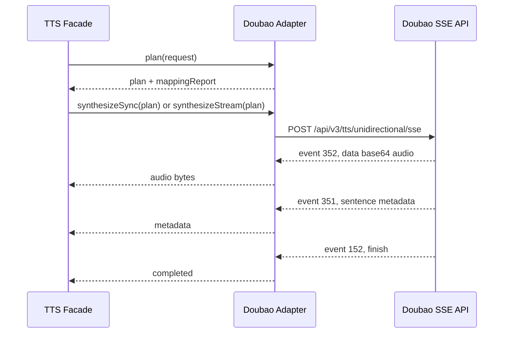

# Doubao Adapter Contract

## Provider

- Provider ID: `doubao`
- Adapter version: `0.1.0`
- Default Resource Id: `seed-icl-2.0`
- Base URL: `https://openspeech.bytedance.com`

## Environment

新版控制台:

```dotenv
DOUBAO_API_KEY=your-api-key
```

旧版控制台:

```dotenv
DOUBAO_APP_ID=your-app-id
DOUBAO_ACCESS_TOKEN=your-access-token
```

兼容小写历史键名：`doubao_api_key`、`doubao_app_id`、`doubao_access_token`、`doubao_access-token`。

## Operation Mapping

| Platform operation | Doubao API | Transport | Adapter behavior |
| --- | --- | --- | --- |
| `tts.sync` | `/api/v3/tts/unidirectional/sse` | HTTP SSE | Reads all `event: 352` audio fragments and concatenates bytes. |
| `tts.stream` | `/api/v3/tts/unidirectional/sse` | HTTP SSE | Emits one platform `audio.chunk` per Doubao audio event. |
| `voice.clone.create` | `/api/v3/tts/voice_clone` | HTTPS JSON | Reads local reference audio and sends `audio.data` as base64. |

## TTS HTTP Contract

### Request

```http
POST /api/v3/tts/unidirectional/sse HTTP/1.1
Content-Type: application/json
X-Api-Key: ${DOUBAO_API_KEY}
X-Api-Resource-Id: seed-icl-2.0
X-Api-Request-Id: ${planId}
```

旧版控制台使用：

```http
X-Api-App-Id: ${DOUBAO_APP_ID}
X-Api-Access-Key: ${DOUBAO_ACCESS_TOKEN}
```

Body:

```json
{
  "user": {
    "uid": "tts_workbench"
  },
  "namespace": "BidirectionalTTS",
  "req_params": {
    "text": "家长您好",
    "speaker": "custom_zh_parent",
    "model": "seed-tts-2.0-standard",
    "audio_params": {
      "format": "mp3",
      "sample_rate": 24000,
      "speech_rate": 0,
      "loudness_rate": 0
    }
  }
}
```

### Canonical Fields

| Canonical field | Doubao field |
| --- | --- |
| `model` | `X-Api-Resource-Id` |
| `text` | `req_params.text` |
| `ssml` | `req_params.ssml` |
| `voice.providerVoiceId` | `req_params.speaker` |
| `output.format` | `req_params.audio_params.format` |
| `output.sampleRateHz` | `req_params.audio_params.sample_rate` |
| `output.bitrate` | `req_params.audio_params.bit_rate`, only for MP3 |
| `controls.speed` | `req_params.audio_params.speech_rate` |
| `controls.volume` | `req_params.audio_params.loudness_rate` |
| `controls.emotion` | `req_params.audio_params.emotion` |

Unsupported canonical fields are recorded in `mappingReport.ignoredFields`.

### Vendor Extension

```json
{
  "vendor": {
    "mode": "prefer_vendor",
    "extensions": {
      "doubao": {
        "schemaVersion": "1.0.0",
        "params": {
          "uid": "tenant-or-user-id",
          "namespace": "BidirectionalTTS",
          "resourceId": "seed-icl-2.0",
          "ttsModel": "seed-tts-2.0-standard",
          "additions": {
            "enable_language_detector": true
          },
          "emotionScale": 4,
          "enableTimestamp": false,
          "enableSubtitle": false,
          "requireUsageTokens": true
        }
      }
    }
  }
}
```

`canonical_only` ignores all vendor extension fields. `vendor_required` fails during planning when the extension is absent.

### SSE Events



Audio event:

```text
event: 352
data: {"code":0,"message":"","data":"base64音频片段"}
```

Finish event:

```text
event: 152
data: {"code":20000000,"message":"OK","data":null,"usage":{"text_words":11}}
```

Any `code` outside `0` and `20000000` is treated as `vendor_execution_failed`.

## Voice Clone Contract

### Request

```http
POST /api/v3/tts/voice_clone HTTP/1.1
Content-Type: application/json
X-Api-Key: ${DOUBAO_API_KEY}
X-Api-Request-Id: ${requestId}
```

Body:

```json
{
  "speaker_id": "custom_speaker_id",
  "custom_speaker_id": "custom_parent_voice",
  "audio": {
    "data": "base64编码后的音频",
    "format": "wav"
  },
  "language": 0,
  "extra_params": {
    "voice_clone_denoise_model_id": ""
  }
}
```

当前 adapter 支持 `referenceAudio.path` 或 `file://` URI，读取本地文件后写入 `audio.data`。HTTP URL 素材暂不在 adapter 内下载。

### Voice Clone Extension

```json
{
  "speakerId": "custom_speaker_id",
  "customSpeakerId": "custom_parent_voice",
  "prepaid": false,
  "languageCode": 0,
  "extraParams": {
    "voice_clone_denoise_model_id": "SpeechInpaintingV2"
  }
}
```

`prepaid=true` 会移除 `custom_speaker_id`，用于预付费 `S_...` 音色槽位。

## Archive

All executions pass through facade planning and filesystem archive. TTS runs save:

```txt
data/runs/{runId}/
  request.json
  plan.json
  mapping-report.json
  vendor-request.json
  vendor-response.json
  result.json
  audio.mp3
```

Voice clone archive stores `vendor-request.json` with base64 audio content. Do not commit real private voice samples or generated run directories.
