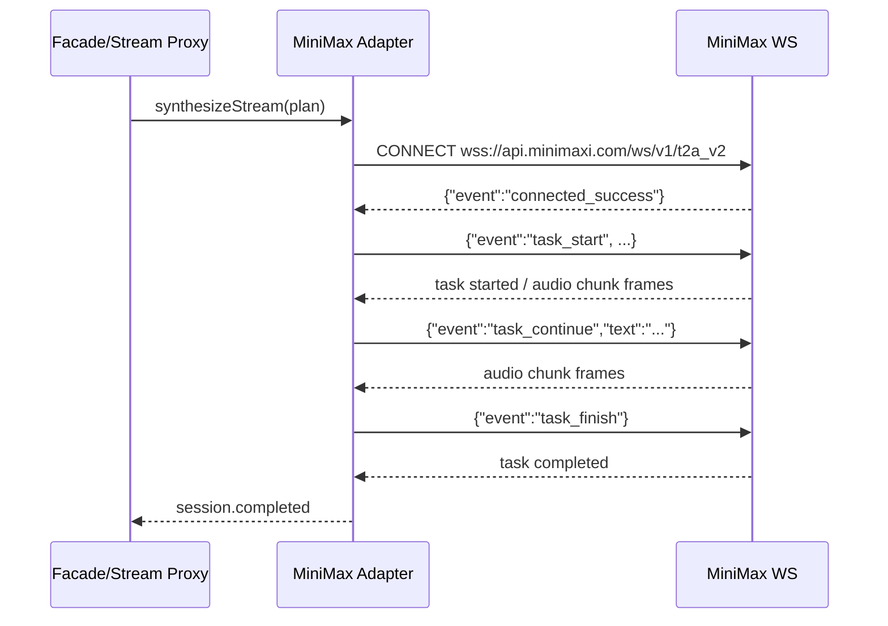
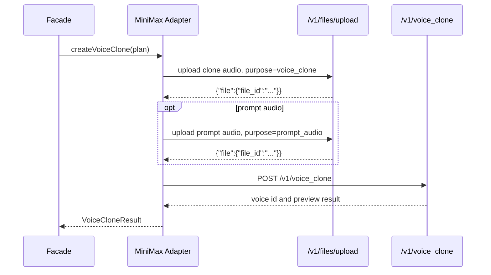

# MiniMax Adapter Contract

## 文档来源

- MiniMax 同步语音合成 HTTP: https://platform.minimaxi.com/docs/api-reference/speech-t2a-http
- MiniMax 同步语音合成 WebSocket: https://platform.minimaxi.com/docs/guides/speech-t2a-websocket
- MiniMax 音色快速复刻: https://platform.minimaxi.com/docs/guides/speech-voice-clone

## Provider Definition

```json
{
  "providerId": "minimax",
  "providerName": "MiniMax",
  "adapterVersion": "0.1.0",
  "vendorFeatures": {
    "supportsHttpTTS": true,
    "supportsStreamingTTS": true,
    "supportsPersistentVoiceClone": true,
    "supportsInstantVoiceClone": false,
    "supportsVoiceCloneDelete": false
  }
}
```

## Models

```json
{
  "defaultModel": "speech-2.8-hd",
  "models": [
    "speech-2.8-hd",
    "speech-2.8-turbo",
    "speech-2.6-hd",
    "speech-2.6-turbo",
    "speech-02-hd",
    "speech-02-turbo",
    "speech-01-hd",
    "speech-01-turbo"
  ],
  "canonicalCapabilities": {
    "supportsText": true,
    "supportsSSML": false,
    "supportedOperations": ["tts.sync", "tts.stream", "voice.clone.create"],
    "outputFormats": ["mp3", "wav", "flac"],
    "outputChunkFormats": ["mp3"],
    "sampleRatesHz": [16000, 24000, 32000, 44100],
    "maxTextChars": 10000,
    "defaultConfiguration": {
      "output": {
        "format": "mp3",
        "sampleRateHz": 32000,
        "bitrate": 128000,
        "channels": 1
      },
      "controls": {
        "speed": 1,
        "pitch": 0,
        "volume": 1
      }
    }
  }
}
```

## HTTP TTS Contract

### Facade Request

```json
{
  "operation": "tts.sync",
  "providerId": "minimax",
  "text": "今天是不是很开心呀(laughs)，当然了！",
  "model": "speech-2.8-hd",
  "voice": {},
  "output": {
    "format": "mp3",
    "sampleRateHz": 32000,
    "bitrate": 128000,
    "channels": 1
  },
  "controls": {
    "speed": 1,
    "volume": 1,
    "pitch": 0,
    "emotion": "happy"
  },
  "vendor": {
    "mode": "prefer_vendor",
    "extensions": {
      "minimax": {
        "schemaVersion": "1.0.0",
        "params": {
          "language_boost": "Chinese",
          "subtitle_enable": false,
          "subtitle_type": "sentence",
          "output_format": "hex",
          "aigc_watermark": false,
          "pronunciation_dict": {
            "tone": ["处理/(chu3)(li3)", "危险/dangerous"]
          }
        }
      }
    }
  }
}
```

### Vendor HTTP Request

```json
{
  "method": "POST",
  "url": "https://api.minimaxi.com/v1/t2a_v2",
  "headers": {
    "Authorization": "Bearer ${MINIMAX_API_KEY}",
    "Content-Type": "application/json"
  },
  "body": {
    "model": "speech-2.8-hd",
    "text": "今天是不是很开心呀(laughs)，当然了！",
    "stream": false,
    "voice_setting": {
      "voice_id": "Chinese (Mandarin)_Gentleman",
      "speed": 1,
      "vol": 1,
      "pitch": 0,
      "emotion": "happy"
    },
    "audio_setting": {
      "sample_rate": 32000,
      "bitrate": 128000,
      "format": "mp3",
      "channel": 1
    },
    "language_boost": "Chinese",
    "subtitle_enable": false,
    "subtitle_type": "sentence",
    "output_format": "hex",
    "aigc_watermark": false,
    "pronunciation_dict": {
      "tone": ["处理/(chu3)(li3)", "危险/dangerous"]
    }
  }
}
```

`MINIMAX_API_KEY` 从后端进程环境变量读取。项目支持根目录 `.env`、`.env.local`、`apps/api/.env`、`apps/api/.env.local`，实际 env 文件已通过 `.gitignore` 排除。

### Vendor HTTP Response

```json
{
  "data": {
    "audio": "<hex encoded audio>",
    "status": 2
  },
  "extra_info": {
    "audio_length": 9900,
    "audio_sample_rate": 32000,
    "audio_size": 160323,
    "bitrate": 128000,
    "word_count": 52,
    "invisible_character_ratio": 0,
    "usage_characters": 26,
    "audio_format": "mp3",
    "audio_channel": 1
  },
  "trace_id": "trace_id",
  "base_resp": {
    "status_code": 0,
    "status_msg": "success"
  }
}
```

### Archive Contract

```txt
data/runs/{runId}/
  request.json
  plan.json
  mapping-report.json
  vendor-request.json
  vendor-response.json
  result.json
  audio.mp3
```

## HTTP Mapping Rules

- `text` -> `text`
- `model` -> `model`; 未配置时使用 `speech-2.8-hd`
- `voice.providerVoiceId || voice.voiceId` -> `voice_setting.voice_id`
- voice 未配置时使用模型默认音色 `Chinese (Mandarin)_Gentleman`
- `controls.speed` -> `voice_setting.speed`
- `controls.volume` -> `voice_setting.vol`
- `controls.pitch` -> `voice_setting.pitch`
- `controls.emotion` -> `voice_setting.emotion`
- `output.sampleRateHz` -> `audio_setting.sample_rate`
- `output.bitrate` -> `audio_setting.bitrate`
- `output.format` -> `audio_setting.format`
- `output.channels` -> `audio_setting.channel`
- `voice.language` 不进入 canonical 映射，语言增强通过 `vendor.extensions.minimax.params.language_boost` 表达
- `ssml` 当前写入 `ignoredFields`，因为 MiniMax speech models 未声明 SSML 支持
- 未配置字段使用 `vendorModels[*].defaultConfiguration`
- 已配置但模型不支持的字段写入 `mapping-report.json` 的 `ignoredFields`

## Vendor Extension Contract

```json
{
  "schemaVersion": "1.0.0",
  "params": {
    "pronunciation_dict": {},
    "timbre_weights": [],
    "language_boost": "Chinese",
    "voice_modify": {},
    "subtitle_enable": false,
    "subtitle_type": "sentence",
    "output_format": "hex",
    "aigc_watermark": false
  }
}
```

## WebSocket TTS Contract

当前 adapter 已声明 `tts.stream` capability，但执行链路尚未实现。后续应将 MiniMax WebSocket 帧转换为平台 `TTSStreamEvent`。



### task_start Frame

```json
{
  "event": "task_start",
  "model": "speech-2.8-hd",
  "voice_setting": {
    "voice_id": "Chinese (Mandarin)_Gentleman",
    "speed": 1,
    "vol": 1,
    "pitch": 0,
    "english_normalization": false
  },
  "audio_setting": {
    "sample_rate": 32000,
    "bitrate": 128000,
    "format": "mp3",
    "channel": 1
  }
}
```

### task_continue Frame

```json
{
  "event": "task_continue",
  "text": "追加文本"
}
```

### task_finish Frame

```json
{
  "event": "task_finish"
}
```

### Platform Event Mapping

```json
[
  {
    "type": "session.started",
    "sessionId": "{sessionId}",
    "planId": "{planId}",
    "sequence": 0
  },
  {
    "type": "audio.chunk",
    "sequence": 1,
    "data": "<Uint8Array decoded from hex>",
    "format": "mp3"
  },
  {
    "type": "session.completed",
    "sequence": 99
  }
]
```

## Voice Clone Contract

当前 adapter 已声明 `voice.clone.create` capability，但执行链路尚未实现。后续必须按多步骤 workflow 归档每一步 vendor request/response。



### Upload Clone Audio Request

```json
{
  "method": "POST",
  "url": "https://api.minimaxi.com/v1/files/upload",
  "headers": {
    "Authorization": "Bearer ${MINIMAX_API_KEY}"
  },
  "multipart": {
    "purpose": "voice_clone",
    "file": "<mp3|m4a|wav, 10s-5min, <=20MB>"
  }
}
```

### Upload Prompt Audio Request

```json
{
  "method": "POST",
  "url": "https://api.minimaxi.com/v1/files/upload",
  "headers": {
    "Authorization": "Bearer ${MINIMAX_API_KEY}"
  },
  "multipart": {
    "purpose": "prompt_audio",
    "file": "<mp3|m4a|wav, <8s, <=20MB>"
  }
}
```

### Voice Clone Request

```json
{
  "method": "POST",
  "url": "https://api.minimaxi.com/v1/voice_clone",
  "headers": {
    "Authorization": "Bearer ${MINIMAX_API_KEY}",
    "Content-Type": "application/json"
  },
  "body": {
    "file_id": "{clone_audio_file_id}",
    "voice_id": "{custom_voice_id}",
    "clone_prompt": {
      "prompt_audio": "{prompt_audio_file_id}",
      "prompt_text": "参考文本"
    },
    "text": "试听文本",
    "model": "speech-2.8-hd"
  }
}
```
