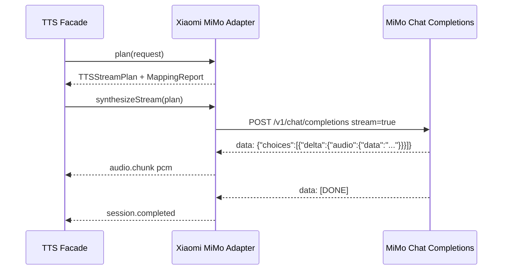

# Xiaomi MiMo Adapter Contract

## 文档来源

- MiMo-V2.5-TTS 官方文档: https://mimo.mi.com/docs/zh-CN/quick-start/usage-guide/audio/speech-synthesis-v2.5
- 本仓库整理: `docs/vendor_api_doc/xiaomi_mimo/mimo_v2.5_tts.md`

## Provider Definition

```json
{
  "providerId": "xiaomi_mimo",
  "providerName": "Xiaomi MiMo",
  "adapterVersion": "0.1.0",
  "vendorFeatures": {
    "supportsHttpTTS": true,
    "supportsStreamingTTS": true,
    "supportsPersistentVoiceClone": false,
    "supportsInstantVoiceClone": true,
    "supportsVoiceCloneDelete": false
  }
}
```

## Environment

```dotenv
MIMO_API_KEY=your-api-key
```

兼容历史键名：

```dotenv
XIAOMI_MIMO_API_KEY=your-api-key
xiaomi_mimo_api_key=your-api-key
mimo_api_key=your-api-key
```

## Models

| Model ID | Platform operation | Notes |
| --- | --- | --- |
| `mimo-v2.5-tts` | `tts.sync`, `tts.stream` | 使用预置音色；当前只声明 `wav` 非流式和 `pcm` 流式。 |
| `mimo-v2.5-tts-voicedesign` | `tts.sync` | 音色描述通过 `vendor.extensions.xiaomi_mimo.params.voiceDesignPrompt` 传入。 |
| `mimo-v2.5-tts-voiceclone` | `voice.clone.instant` | 请求内携带参考音频 data URI，不返回持久 voiceId。 |

## HTTP TTS Contract

### Facade Request

```json
{
  "operation": "tts.sync",
  "providerId": "xiaomi_mimo",
  "text": "Hey boss, I just got the results back and I passed.",
  "model": "mimo-v2.5-tts",
  "voice": {
    "providerVoiceId": "Chloe"
  },
  "output": {
    "format": "wav",
    "sampleRateHz": 24000,
    "channels": 1
  },
  "vendor": {
    "mode": "prefer_vendor",
    "extensions": {
      "xiaomi_mimo": {
        "schemaVersion": "1.0.0",
        "params": {
          "stylePrompt": "Bright, upbeat, slightly fast.",
          "assistantPrefix": "(开心)"
        }
      }
    }
  }
}
```

### Vendor HTTP Request

```json
{
  "method": "POST",
  "url": "https://api.xiaomimimo.com/v1/chat/completions",
  "headers": {
    "api-key": "${MIMO_API_KEY}",
    "Content-Type": "application/json"
  },
  "body": {
    "model": "mimo-v2.5-tts",
    "messages": [
      {
        "role": "user",
        "content": "Bright, upbeat, slightly fast."
      },
      {
        "role": "assistant",
        "content": "(开心)Hey boss, I just got the results back and I passed."
      }
    ],
    "audio": {
      "format": "wav",
      "voice": "Chloe"
    }
  }
}
```

### Vendor HTTP Response

```json
{
  "choices": [
    {
      "message": {
        "audio": {
          "data": "<base64 encoded wav audio>"
        }
      }
    }
  ]
}
```

Adapter 解码 `choices[0].message.audio.data`，写入：

```txt
data/runs/{runId}/audio.wav
```

## Stream TTS Contract

当前 adapter 仅把 `mimo-v2.5-tts` 声明为低延迟 `tts.stream` 模型。

### Vendor Stream Request

```json
{
  "method": "POST",
  "url": "https://api.xiaomimimo.com/v1/chat/completions",
  "headers": {
    "api-key": "${MIMO_API_KEY}",
    "Content-Type": "application/json"
  },
  "body": {
    "model": "mimo-v2.5-tts",
    "messages": [
      {
        "role": "assistant",
        "content": "Streaming synthesis test."
      }
    ],
    "audio": {
      "format": "pcm16",
      "voice": "Chloe"
    },
    "stream": true
  }
}
```

### Stream Event Mapping



平台 archive 保存 `vendor-events.ndjson` 和拼接后的 `audio.pcm`。

## Voice Design Contract

`mimo-v2.5-tts-voicedesign` 通过文本描述即时设计音色，不写入 voice registry。

```json
{
  "model": "mimo-v2.5-tts-voicedesign",
  "messages": [
    {
      "role": "user",
      "content": "A warm young male voice, casual and confident."
    },
    {
      "role": "assistant",
      "content": "Yes, I had a sandwich."
    }
  ],
  "audio": {
    "format": "wav",
    "optimize_text_preview": true
  }
}
```

`voiceDesignPrompt` 是 vendor extension，不进入 canonical request。

## Instant Voice Clone Contract

### Facade Request

```json
{
  "operation": "voice.clone.instant",
  "providerId": "xiaomi_mimo",
  "text": "Yes, I had a sandwich.",
  "model": "mimo-v2.5-tts-voiceclone",
  "referenceAudio": [
    {
      "uri": "data:audio/mpeg;base64,<base64 reference audio>",
      "format": "mp3"
    }
  ],
  "output": {
    "format": "wav",
    "sampleRateHz": 24000
  },
  "consent": {
    "confirmed": true,
    "usageScope": "internal_eval"
  }
}
```

### Vendor HTTP Request

```json
{
  "model": "mimo-v2.5-tts-voiceclone",
  "messages": [
    {
      "role": "assistant",
      "content": "Yes, I had a sandwich."
    }
  ],
  "audio": {
    "format": "wav",
    "voice": "data:audio/mpeg;base64,<base64 reference audio>"
  }
}
```

### Archive Risk

`vendor-request.json` 会包含参考音频 data URI。真实私密声音样本对应的 run 目录不要提交到 git，也不要外发。

## Vendor Extension

```json
{
  "stylePrompt": "Bright and upbeat.",
  "assistantPrefix": "(开心)",
  "voiceDesignPrompt": "A warm young male voice.",
  "optimizeTextPreview": true
}
```

`canonical_only` 会忽略所有 vendor extension。`vendor_required` 在 extension 缺失时于 plan 阶段失败。

## Archive Contract

所有执行都经过 facade plan 和文件系统 archive：

```txt
data/runs/{runId}/
  request.json
  plan.json
  mapping-report.json
  vendor-request.json
  vendor-response.json
  result.json
  audio.wav | audio.pcm
```
