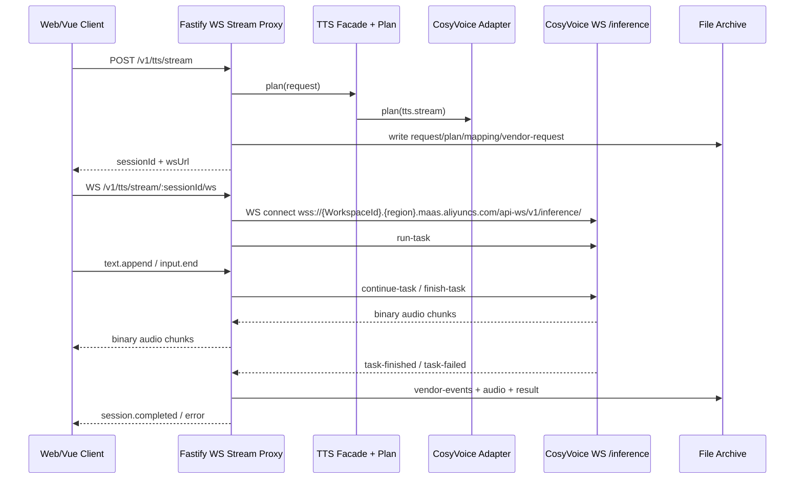

# CosyVoice 上下游 WebSocket 桥接设计

## 设计目标

本文记录 CosyVoice 实时语音合成接入时，上游 WebSocket 和下游 WebSocket 的连接方式。

核心目标是：前端只连接本平台后端，不直接连接 CosyVoice；后端负责 adapter plan、厂商鉴权、上游 WebSocket 协议转换、音频转发和 archive 写入。

```txt
Web / Vue Client
  -> Platform Downstream WebSocket
  -> Fastify Stream Proxy
  -> TTS Facade
  -> CosyVoice Adapter
  -> CosyVoice Upstream WebSocket
```

## 核心原则

- 浏览器不得直连 CosyVoice。
- CosyVoice API Key、WorkspaceId、地域 endpoint 只存在于后端环境变量和 adapter 配置中。
- 下游 WebSocket 协议由本平台定义，保持跨厂商稳定。
- 上游 WebSocket 协议由 CosyVoice adapter 封装，不泄漏到前端。
- 所有真实流式执行仍必须先 `plan()`，再连接厂商。
- 每次流式执行仍必须保存 request、plan、mapping report、vendor request、vendor events、result 和音频。

## 推荐连接时序



## 下游 WebSocket 协议

下游 WebSocket 是前端与本平台 API 之间的协议。它不暴露厂商事件名，也不暴露厂商鉴权方式。

建议第一版使用：

```txt
POST /v1/tts/stream
WS   /v1/tts/stream/{sessionId}/ws
```

`POST /v1/tts/stream` 只负责创建 stream session：

```json
{
  "sessionId": "plan_xxx",
  "providerId": "cosyvoice",
  "operation": "tts.stream",
  "protocol": "websocket",
  "url": "/v1/tts/stream/plan_xxx/ws"
}
```

下游客户端发送 JSON 文本帧：

```json
{ "type": "client.ready" }
```

```json
{ "type": "text.append", "text": "家长您好，我们这边可以先给孩子安排一节免费的试听课。" }
```

```json
{ "type": "input.end" }
```

```json
{ "type": "cancel" }
```

后端向下游客户端发送 JSON 文本帧：

```json
{ "type": "session.started", "sessionId": "plan_xxx", "sequence": 0 }
```

```json
{ "type": "metadata", "sequence": 1, "payload": { "providerId": "cosyvoice" } }
```

```json
{ "type": "warning", "sequence": 2, "warning": { "message": "..." } }
```

```json
{ "type": "session.completed", "sequence": 99, "durationMs": 1234 }
```

```json
{ "type": "error", "sequence": 100, "message": "CosyVoice task failed." }
```

后端向下游客户端发送 binary 帧：

```txt
raw audio chunk
```

第一版可以直接透传上游返回的 binary audio chunk。前端负责按 `metadata` 中的 format/sampleRate 播放或拼接 Blob。

## 上游 CosyVoice WebSocket 协议

上游 WebSocket 是本平台 API 与 CosyVoice 之间的协议，只能由 CosyVoice adapter 或 stream transport 层使用。

官方实时语音合成文档中，CosyVoice Workspace 入口使用：

```txt
wss://{WorkspaceId}.cn-beijing.maas.aliyuncs.com/api-ws/v1/inference/
wss://{WorkspaceId}.ap-southeast-1.maas.aliyuncs.com/api-ws/v1/inference/
```

项目当前支持 DashScope 全局 inference 入口：

```txt
wss://dashscope.aliyuncs.com/api-ws/v1/inference
```

这条路径只依赖 API Key，不依赖 WorkspaceId。运行时通过 `COSYVOICE_STREAM_ENDPOINT` 或 `DASHSCOPE_INFERENCE_ENDPOINT` 配置；未配置 endpoint 且未配置 WorkspaceId 时，adapter 会默认使用该全局 inference endpoint。

旧代码中的 `wss://dashscope.aliyuncs.com/api-ws/v1/realtime` 是另一套 DashScope realtime 协议入口。当前 CosyVoice adapter 使用 `run-task` / `SpeechSynthesizer` task 帧，只支持 `/api-ws/v1/inference`，因此显式配置 `/realtime` 时需要规范化到同 host 的 `/inference` 并在 mapping report 中记录 warning。

北京地域可用于 `cosyvoice-v3.5-plus`、`cosyvoice-v3.5-flash`、`cosyvoice-v3-plus`、`cosyvoice-v3-flash`、`cosyvoice-v2`、`cosyvoice-v1`。新加坡地域主要用于 `cosyvoice-v3-plus`、`cosyvoice-v3-flash`。

连接 header：

```txt
Authorization: bearer ${DASHSCOPE_API_KEY}
X-DashScope-DataInspection: enable
```

上游启动任务：

```json
{
  "header": {
    "action": "run-task",
    "task_id": "uuid_without_dash_or_plan_id",
    "streaming": "duplex"
  },
  "payload": {
    "task_group": "audio",
    "task": "tts",
    "function": "SpeechSynthesizer",
    "model": "cosyvoice-v3-flash",
    "parameters": {
      "text_type": "PlainText",
      "voice": "longanyang",
      "format": "mp3",
      "sample_rate": 24000,
      "volume": 50,
      "rate": 1,
      "pitch": 1,
      "enable_ssml": false
    },
    "input": {}
  }
}
```

收到上游 `task-started` 后，发送文本：

```json
{
  "header": {
    "action": "continue-task",
    "task_id": "same_task_id",
    "streaming": "duplex"
  },
  "payload": {
    "input": {
      "text": "床前明月光，疑是地上霜。"
    }
  }
}
```

文本输入结束后，发送：

```json
{
  "header": {
    "action": "finish-task",
    "task_id": "same_task_id",
    "streaming": "duplex"
  },
  "payload": {
    "input": {}
  }
}
```

上游返回：

- binary frame：音频 chunk。
- text frame，`header.event = task-started`：任务已开始，可以发送文本。
- text frame，`header.event = result-generated`：可能包含中间 metadata。
- text frame，`header.event = task-finished`：任务完成。
- text frame，`header.event = task-failed`：任务失败，读取 `header.error_message`。

## Facade 和 Adapter 分层

`TTSFacade.synthesizeStream()` 不应直接连接 WebSocket。它只负责解析 voice、获取 adapter、调用 `plan()`，并创建可被 stream runner 消费的 session。

CosyVoice adapter 负责：

- 生成 `TTSStreamPlan`。
- 将 canonical request 映射为 CosyVoice `run-task` parameters。
- 记录 `MappingReport`。
- 通过 `synthesizeStream(plan)` 产出统一 `TTSStreamEvent`。

Stream runner 负责：

- 接收下游 WebSocket。
- 启动 adapter 的 `synthesizeStream(plan)`。
- 将 `audio.chunk` 转成下游 binary frame。
- 将 `metadata`、`warning`、`session.completed`、`error` 转成下游 JSON frame。
- 处理下游断开、取消和上游关闭。

## Archive 设计

流式执行也必须进入文件系统 archive。建议目录：

```txt
data/runs/{runId}/
  request.json
  plan.json
  mapping-report.json
  vendor-request.json
  vendor-events.ndjson
  vendor-response.json
  result.json
  audio.mp3
```

其中：

- `vendor-request.json` 保存 `run-task` 初始请求和关键连接配置，不能保存 API Key。
- `vendor-events.ndjson` 保存上游 text frame、下游控制事件和关键状态变化。
- `vendor-response.json` 保存最终 `task-finished` 或 `task-failed` 摘要。
- `audio.mp3` 或 `audio.wav` 保存拼接后的音频。
- `result.json` 标记 `succeeded`、`failed` 或 `cancelled`。

如果下游客户端中途断开，后端应：

- 主动关闭上游 WebSocket。
- 将 run 标记为 `failed` 或 `cancelled`。
- 保存已收到的 vendor events 和部分音频。

## MVP 实现顺序

第一阶段只做一条下游 WebSocket 对一条上游 WebSocket：

1. 新增 CosyVoice adapter 的 `tts.stream` plan。
2. 增加 stream session registry，保存 plan 和状态。
3. 引入 Fastify WebSocket 插件，新增 `/v1/tts/stream/{sessionId}/ws`。
4. 实现 CosyVoice upstream WS transport。
5. 将上游 binary audio 转发为下游 binary frame。
6. 将上游 text event 转换为统一 JSON event。
7. 完成流式 archive 写入。
8. 补单元测试和一个 mock stream adapter 闭环测试。

暂不做：

- 上游连接池。
- 多客户端订阅同一个 stream session。
- 浏览器直接透传厂商协议。
- DashScope 全局 `/realtime` 协议分支。
- WebSocket 声音复刻。

## 连接池后续策略

CosyVoice WebSocket 可以考虑后续引入连接池，但不建议第一版实现。

连接池需要额外处理：

- 任务完成后连接是否可复用。
- 厂商失败连接是否必须丢弃。
- 空闲超时。
- 不同 model、voice、format、sampleRate 之间是否可以复用。
- 上游连接与下游 session 的隔离。

第一版采用每次 stream session 独立连接，状态更清楚，也更容易保证 archive 可复现。

## 关键风险

- `cosyvoice-v3.5-plus` 和 `cosyvoice-v3.5-flash` 仅北京地域可用，且无系统音色，必须先有声音复刻或声音设计音色。
- CosyVoice Workspace `/api-ws/v1/inference` 和 DashScope 全局 `/api-ws/v1/inference` 都是可用的 stream endpoint；HTTP 非实时和声音复刻仍使用 Workspace HTTP。
- DashScope 全局 `/api-ws/v1/realtime` 不能直接复用 CosyVoice task 帧；当前兼容策略是规范化到 `/inference`，后续若要支持真正 realtime 协议需要新增独立 protocol branch。
- `enable_ssml=true` 时，上游可能限制只能发送一次 `continue-task`，需要在 mapping report 中记录 SSML 模式约束。
- 下游断开时必须关闭上游，避免后台继续计费或产生孤儿任务。
- 流式 archive 不能只保存最终音频，必须保存 vendor events，后续 benchmark 和问题排查依赖这些事件。
