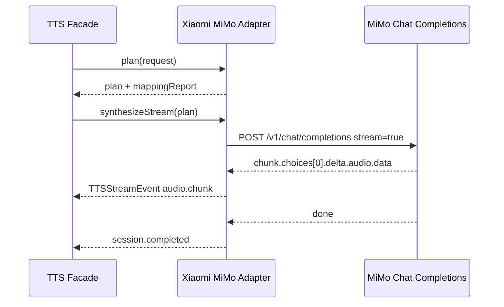

# MiMo-V2.5-TTS 系列整理

## 文档来源

- 官方文档：[语音合成（MiMo-V2.5-TTS 系列）](https://mimo.mi.com/docs/zh-CN/quick-start/usage-guide/audio/speech-synthesis-v2.5)
- 官方文档更新时间：2026-06-12
- 本整理日期：2026-07-08

## 一句话结论

MiMo-V2.5-TTS 系列是 OpenAI Chat Completions 风格的语音合成接口。目标合成文本放在 `role: assistant` 的 message 中，风格和语气控制放在 `role: user` 的 message 中，返回音频以 base64 形式出现在 `message.audio.data` 或流式 `delta.audio.data` 中。

后续如果接入本项目 adapter，应保持 `request -> plan -> mappingReport -> vendor execution -> filesystem archive` 闭环，不要把 MiMo 的 `messages` / `audio` 厂商结构泄漏到 canonical request。

## Provider 接入定位

当前 adapter provider 定义：

```json
{
  "providerId": "xiaomi_mimo",
  "providerName": "Xiaomi MiMo",
  "adapterVersion": "0.1.0",
  "baseUrl": "https://api.xiaomimimo.com/v1",
  "vendorFeatures": {
    "supportsHttpTTS": true,
    "supportsStreamingTTS": true,
    "supportsPersistentVoiceClone": false,
    "supportsInstantVoiceClone": true,
    "supportsVoiceCloneDelete": false
  }
}
```

鉴权：

```http
api-key: ${MIMO_API_KEY}
```

环境变量建议：

```dotenv
MIMO_API_KEY=your-api-key
```

## 模型矩阵

| Model ID | 功能定位 | 建议平台 operation | 音色来源 | 流式状态 | 关键限制 |
| --- | --- | --- | --- | --- | --- |
| `mimo-v2.5-tts` | 使用预置精品音色合成 | `tts.sync`, `tts.stream` | `audio.voice` 传预置 voice id | 已支持低延迟流式 | 支持唱歌标签；不支持音色设计和音色复刻 |
| `mimo-v2.5-tts-voicedesign` | 用文本描述即时设计音色 | `tts.sync`，可兼容 `tts.stream` | `user` message 的音色描述 | 低延迟流式暂未上线，当前是完成后一次返回的兼容模式 | 不支持唱歌、预置音色、音频样本复刻 |
| `mimo-v2.5-tts-voiceclone` | 用音频样本即时复刻并合成 | `voice.clone.instant`，也可作为专用 TTS 执行流 | `audio.voice` 传 data URI 音频样本 | 低延迟流式暂未上线，当前是完成后一次返回的兼容模式 | 不产生持久 voiceId，不支持音色设计 |

## 预置音色

`mimo-v2.5-tts` 使用 `audio.voice` 指定预置音色。

| 音色名 | Voice ID | 语言 | 性别 |
| --- | --- | --- | --- |
| MiMo-默认 | `mimo_default` | 因部署集群而异 | 因部署集群而异 |
| 冰糖 | `冰糖` | 中文 | 女性 |
| 茉莉 | `茉莉` | 中文 | 女性 |
| 苏打 | `苏打` | 中文 | 男性 |
| 白桦 | `白桦` | 中文 | 男性 |
| Mia | `Mia` | 英文 | 女性 |
| Chloe | `Chloe` | 英文 | 女性 |
| Milo | `Milo` | 英文 | 男性 |
| Dean | `Dean` | 英文 | 男性 |

## 通用调用规则

- 合成目标文本必须放在 `messages[*].role = "assistant"` 的消息中。
- `user` 消息可选，可用于自然语言风格控制或对话历史；使用 `mimo-v2.5-tts-voicedesign` 时，`user` 消息是必填音色描述。
- 流式调用时应使用 `audio.format = "pcm16"`，官方示例按 24 kHz、PCM16LE、mono 拼接。
- 自然语言控制放在 `user.content`，例如语气、角色、场景、导演式提示。
- 音频标签控制放在 `assistant.content`，例如 `(开心)`、`(粤语)`、`(唱歌)`、`[笑]`、`[叹气]` 等标签。

## HTTP TTS Contract

### Facade Request 示例

```json
{
  "operation": "tts.sync",
  "providerId": "xiaomi_mimo",
  "text": "Hey boss, I just got the results back and I passed.",
  "model": "mimo-v2.5-tts",
  "voice": {
    "providerVoiceId": "Chloe"
  },
  "output": {
    "format": "wav",
    "sampleRateHz": 24000,
    "channels": 1
  },
  "vendor": {
    "mode": "prefer_vendor",
    "extensions": {
      "xiaomi_mimo": {
        "schemaVersion": "1.0.0",
        "params": {
          "stylePrompt": "Bright, upbeat, slightly fast, with rising pitch at the end."
        }
      }
    }
  }
}
```

### Vendor HTTP Request

```json
{
  "method": "POST",
  "url": "https://api.xiaomimimo.com/v1/chat/completions",
  "headers": {
    "api-key": "${MIMO_API_KEY}",
    "Content-Type": "application/json"
  },
  "body": {
    "model": "mimo-v2.5-tts",
    "messages": [
      {
        "role": "user",
        "content": "Bright, upbeat, slightly fast, with rising pitch at the end."
      },
      {
        "role": "assistant",
        "content": "Hey boss, I just got the results back and I passed."
      }
    ],
    "audio": {
      "format": "wav",
      "voice": "Chloe"
    }
  }
}
```

### Vendor HTTP Response

非流式响应按 OpenAI Chat Completions 结构读取：

```json
{
  "choices": [
    {
      "message": {
        "audio": {
          "data": "<base64 encoded audio>"
        }
      }
    }
  ]
}
```

Adapter 执行时应解码 `choices[0].message.audio.data`，再写入统一 archive 的 `audio.wav`。

## Stream Contract

`mimo-v2.5-tts` 的低延迟流式已上线，建议映射到平台 `tts.stream`。`mimo-v2.5-tts-voicedesign` 和 `mimo-v2.5-tts-voiceclone` 当前只适合声明为兼容式流式：API 形态是流式，但实际在推理完成后一次返回音频结果。

### Facade Request 示例

```json
{
  "operation": "tts.stream",
  "providerId": "xiaomi_mimo",
  "text": "Hey boss, I just got the results back and I passed.",
  "model": "mimo-v2.5-tts",
  "voice": {
    "providerVoiceId": "Chloe"
  },
  "output": {
    "format": "pcm",
    "sampleRateHz": 24000,
    "channels": 1
  },
  "stream": {
    "protocol": "sse",
    "chunkFormat": "pcm"
  },
  "vendor": {
    "mode": "prefer_vendor",
    "extensions": {
      "xiaomi_mimo": {
        "schemaVersion": "1.0.0",
        "params": {
          "stylePrompt": "Bright, upbeat, slightly fast, with rising pitch at the end."
        }
      }
    }
  }
}
```

### Vendor Stream Request

```json
{
  "method": "POST",
  "url": "https://api.xiaomimimo.com/v1/chat/completions",
  "headers": {
    "api-key": "${MIMO_API_KEY}",
    "Content-Type": "application/json"
  },
  "body": {
    "model": "mimo-v2.5-tts",
    "messages": [
      {
        "role": "user",
        "content": "Bright, upbeat, slightly fast, with rising pitch at the end."
      },
      {
        "role": "assistant",
        "content": "Hey boss, I just got the results back and I passed."
      }
    ],
    "audio": {
      "format": "pcm16",
      "voice": "Chloe"
    },
    "stream": true
  }
}
```

### Stream Event Mapping

官方 Python 示例通过 OpenAI SDK 遍历 chunk，并从 `chunk.choices[0].delta.audio.data` 读取 base64 PCM 音频。Adapter 可按以下方式映射：



流式音频归档建议：

```txt
data/runs/{runId}/
  request.json
  plan.json
  mapping-report.json
  vendor-request.json
  vendor-events.ndjson
  vendor-response.json
  result.json
  audio.wav
```

如果 archive 最终保存为 WAV，需要在 adapter 或 archive 层给 PCM16LE mono 数据补 WAV header，并在 mapping report 的 `approximations` 记录 `stream.chunkFormat=pcm` 到 `audio.wav` 容器的包装行为。

## Voice Design Contract

`mimo-v2.5-tts-voicedesign` 不需要音频样本，只通过 `user` message 的音色描述生成即时音色。

### Vendor Request

```json
{
  "model": "mimo-v2.5-tts-voicedesign",
  "messages": [
    {
      "role": "user",
      "content": "A warm young male voice, casual and confident, speaking at a relaxed pace."
    },
    {
      "role": "assistant",
      "content": "Yes, I had a sandwich."
    }
  ],
  "audio": {
    "format": "wav",
    "optimize_text_preview": true
  }
}
```

建议把音色描述放入 vendor extension，而不是新增 canonical 字段：

```json
{
  "vendor": {
    "mode": "prefer_vendor",
    "extensions": {
      "xiaomi_mimo": {
        "schemaVersion": "1.0.0",
        "params": {
          "voiceDesignPrompt": "A warm young male voice, casual and confident.",
          "optimizeTextPreview": true
        }
      }
    }
  }
}
```

映射建议：

- `text` -> `messages[role=assistant].content`
- `vendor.extensions.xiaomi_mimo.params.voiceDesignPrompt` -> `messages[role=user].content`
- `vendor.extensions.xiaomi_mimo.params.optimizeTextPreview` -> `audio.optimize_text_preview`
- 若 `optimizeTextPreview=true` 且请求未给 `text`，可以允许 vendor 根据音色描述生成预览文本；但平台 canonical `TTSSyncRequest.text` 当前是必填，因此第一版 adapter 建议仍要求 `text`。

## Instant Voice Clone Contract

`mimo-v2.5-tts-voiceclone` 是即时音色复刻：请求内携带参考音频并直接合成目标文本，不产生可复用的持久 `voiceId`。因此它更适合映射到平台 `voice.clone.instant`，不应作为 `voice.clone.create`。

参考音频要求：

- 传入 Base64 编码后的 data URI。
- 编码后字符串大小不超过 10 MB。
- 当前支持 `mp3` 和 `wav` 样本。
- MIME 可使用 `audio/mpeg`、`audio/mp3` 或 `audio/wav`。

### Facade Request 示例

```json
{
  "operation": "voice.clone.instant",
  "providerId": "xiaomi_mimo",
  "text": "Yes, I had a sandwich.",
  "referenceAudio": [
    {
      "uri": "file:///absolute/path/to/reference.mp3",
      "format": "mp3"
    }
  ],
  "output": {
    "format": "wav",
    "sampleRateHz": 24000
  },
  "consent": {
    "confirmed": true,
    "usageScope": "internal_eval"
  }
}
```

### Vendor Request

```json
{
  "model": "mimo-v2.5-tts-voiceclone",
  "messages": [
    {
      "role": "user",
      "content": ""
    },
    {
      "role": "assistant",
      "content": "Yes, I had a sandwich."
    }
  ],
  "audio": {
    "format": "wav",
    "voice": "data:audio/mpeg;base64,<base64 encoded reference audio>"
  }
}
```

归档风险：

- `vendor-request.json` 会包含 base64 参考音频。
- 真实私密样本 run 目录不能提交。
- 如果后续要支持大样本，建议在 archive 中拆分 `reference-audio.*` 与脱敏 `vendor-request.json`，但这需要先明确是否仍满足“vendor request 不丢弃”的项目约束。

## Canonical Mapping 建议

| Canonical field | MiMo vendor field | 说明 |
| --- | --- | --- |
| `model` | `model` | 三个模型语义差异大，必须按 operation 校验 |
| `text` | `messages[role=assistant].content` | 目标文本不能放到 `user` |
| `voice.providerVoiceId` | `audio.voice` | 仅 `mimo-v2.5-tts` 预置音色适用 |
| `output.format=wav` | `audio.format=wav` | 非流式示例确认可用 |
| `stream.chunkFormat=pcm` | `audio.format=pcm16` | 流式建议强制使用 PCM16 |
| `controls.style` | `messages[role=user].content` 或 assistant 标签 | 属于近似映射，应记录 `approximations` |
| `controls.emotion` | `messages[role=user].content` 或 assistant 标签 | 属于自然语言/标签控制，不是数值字段 |
| `controls.speed` | `messages[role=user].content` 或 assistant 标签 | 没有独立 speed 参数，应记录 `approximations` |
| `controls.pitch` | `messages[role=user].content` | 没有独立 pitch 参数，应记录 `approximations` |
| `ssml` | 无 | 当前应写入 `ignoredFields` |
| `referenceAudio[0]` | `audio.voice=data:{mime};base64,...` | 仅 `mimo-v2.5-tts-voiceclone` 适用 |

## Vendor Extension Schema 建议

第一版 adapter 可收束以下专有参数：

```json
{
  "schemaVersion": "1.0.0",
  "title": "Xiaomi MiMo TTS extension",
  "jsonSchema": {
    "type": "object",
    "additionalProperties": false,
    "properties": {
      "stylePrompt": {
        "type": "string",
        "description": "写入 user message 的自然语言风格控制。"
      },
      "assistantPrefix": {
        "type": "string",
        "description": "追加到 assistant 文本开头的音频标签，例如 (开心) 或 (唱歌)。"
      },
      "voiceDesignPrompt": {
        "type": "string",
        "description": "mimo-v2.5-tts-voicedesign 的音色描述。"
      },
      "optimizeTextPreview": {
        "type": "boolean",
        "description": "映射到 audio.optimize_text_preview。"
      },
      "rawMessages": {
        "type": "array",
        "description": "调试用原始 messages 覆盖入口；默认不建议在 UI 暴露。"
      }
    }
  }
}
```

`canonical_only` 模式下必须忽略所有 vendor extension，只使用 canonical 字段生成最小请求。由于 MiMo 的风格控制高度依赖自然语言，公平 Benchmark 应优先使用 `mimo-v2.5-tts`、固定预置音色、固定 `output.format`。

## Capability 建议

```json
{
  "operations": {
    "tts.sync": {
      "supported": true,
      "transportProtocols": ["https"],
      "outputFormats": ["wav"],
      "sampleRatesHz": [24000],
      "canonicalControls": {
        "style": {
          "support": "approximated",
          "notes": ["通过 user prompt 或 assistant 音频标签近似表达。"]
        },
        "emotion": {
          "support": "approximated",
          "notes": ["通过自然语言和标签控制表达。"]
        },
        "speed": {
          "support": "approximated",
          "notes": ["通过自然语言或标签控制表达，不是独立参数。"]
        },
        "pitch": {
          "support": "approximated",
          "notes": ["通过自然语言提示表达，不是独立参数。"]
        }
      }
    },
    "tts.stream": {
      "supported": true,
      "transportProtocols": ["sse"],
      "outputChunkFormats": ["pcm"],
      "sampleRatesHz": [24000],
      "notes": ["只有 mimo-v2.5-tts 具备低延迟流式；voicedesign/voiceclone 为兼容式流式。"]
    },
    "voice.clone.instant": {
      "supported": true,
      "voiceClone": {
        "persistent": false,
        "instant": true,
        "requiresTranscript": false,
        "supportedAudioFormats": ["mp3", "wav"],
        "maxReferenceAudioFiles": 1
      }
    },
    "voice.clone.create": {
      "supported": false
    },
    "voice.clone.delete": {
      "supported": false
    }
  }
}
```

## 当前实现状态

- Adapter 目录：`apps/api/src/adapters/xiaomi-mimo`
- Provider ID：`xiaomi_mimo`
- 已注册到 API provider registry。
- 已支持 `tts.sync`、`tts.stream`、`voice.clone.instant`。
- 已补 `Contract.md`、sync examples 和 plan/mapping 单元测试。
- `voice.clone.instant` 已有 API route：`POST /v1/voice-clones/instant`。

## 待确认问题

- 官方页面示例只明确非流式 `wav` 和流式 `pcm16`；是否支持 `mp3`/`opus` 输出需要另查 API 参考或真实验收。
- 流式事件底层是否严格为 SSE 兼容 OpenAI chunk，adapter 实现时要用 injectable fetch/stream fixture 锁定。
- `mimo-v2.5-tts-voicedesign` 的 `optimize_text_preview=true` 可不传 assistant message，但当前 core `TTSSyncRequest.text` 是必填；是否要开放“生成预览文本”模式需要单独设计。
- `mimo-v2.5-tts-voiceclone` 是即时复刻，不返回持久 voiceId；如果 UI 想复用样本，需要在本地 registry 记录 reference audio 配置，而不是登记 vendor voiceId。

## 合规提醒

音色复刻必须获得声音本人授权。任何包含真人样本的 `vendor-request.json`、`plan.json` 或 run archive 都应视为敏感材料，不能提交到 git。
